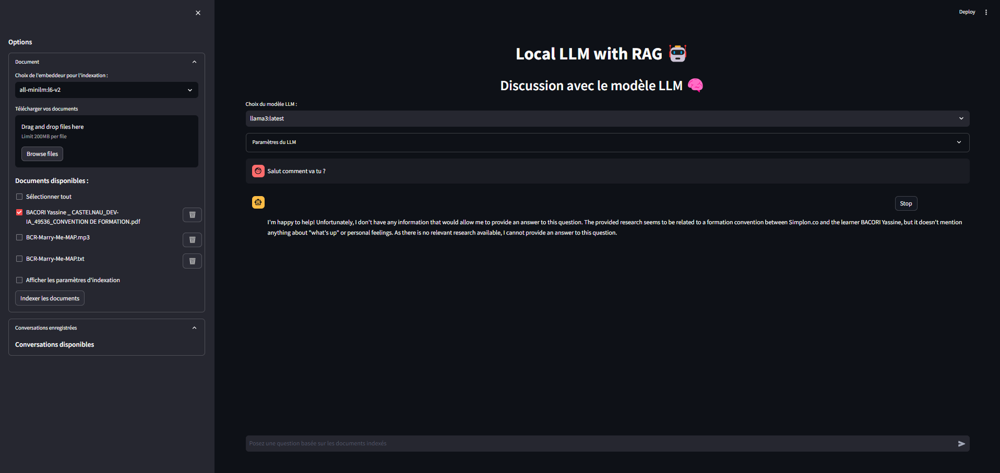

# Local LLM with RAG 📚

Bienvenue dans l'application **Local LLM with RAG** ! Ce projet est conçu pour explorer l'intégration de la recherche augmentée par les connaissances (RAG) en utilisant **Ollama**, **Langchain**, et **Streamlit**. 

L'application permet de charger et indexer des documents, d'interroger ces documents avec des modèles locaux, et de visualiser les réponses en fonction des informations présentes dans les documents. L'application est orientée utilisateur avec une interface moderne et intuitive.

## Fonctionnalités
- 💬 **Chat avec un modèle LLM local** : Posez des questions sur des documents indexés en utilisant Ollama.
- 📑 **Indexation de documents** : Chargez et indexez divers types de documents (.txt, .pdf, .docx, .pptx, .xlsx).
- 🎙️ **Transcription audio** : Convertissez des fichiers audio en texte pour enrichir les connaissances.
- 🔍 **Recherche Augmentée par les Connaissances (RAG)** : Intégrez des modèles de Langchain pour interagir avec des segments de documents indexés.

 *(Exemple d'une conversation avec le LLM)*

## Technologies Used

- [Langchain](https://github.com/langchain/langchain): A Python library for working with Large Language Model
- [Ollama](https://ollama.ai/): A platform for running Large Language models locally.
- [Chroma](https://docs.trychroma.com/): A vector database for storing and retrieving embeddings.
- [Streamlit](https://streamlit.io/): A web framework for creating interactive applications for machine learning and data science projects.


## Installation

Pour installer l'application sur votre machine locale, suivez les étapes suivantes :

### 1. Installez le projet

Commencez par cloner ce dépôt Git sur votre machine :

```bash
<<<<<<< HEAD
git clone https://pawssource.ent.cgi.com/gitlab/wse/GRADIENT/  ia_gen_pocs_yassine/ragllm_app.git
=======
git clone https://pawssource.ent.cgi.com/gitlab/wse/GRADIENT/ia_gen_pocs_yassine/ragllm_app.git
>>>>>>> 369027072c21f8c1e994ceea0427e5b517446c78
cd ragllm_app
pip install -r requirements.txt
```


### 2. Exectutez le projet

Aprés avoir tout installer voici comment l'executer :

Aprés avoir tout installer y compris Ollama dans un terminal telecharger un model et un embeddeur via Ollama 

- [Ollama](https://ollama.com/library):Liste de model disponible avec ollama

Pour l'exemple nous allons essayer avec un embeddeur et un LLM 

Dans un terminal : 

```bash
ollama pull nomic-embed-text
ollama run llama3
```
Une fois les le projet, ces dependences et les model telecharge vous allez pouvoir executer le projet avec la commence 

```bash
cd ragllm_app
streamlit run main.py
```

### Final 
Merci d'avoir utilisé mon projet et Merci a CGI pour ce stage incroyable de 5 mois ❤️

